Hola :wave:,

I am Software Engineer from Mexico :mexico: based in Seattle, WA. I have a B.S. in Computer Science by Tecnologico de Monterrey, and a M.S. in Computer Science with a Specialization in Machine Learning by Georgia Institute of Technology. I'm interested in Artificial Intelligence, particularly Reinforcement Learning, and Robotics.

## :computer: Projects

### Deep Learning Mini Projects

These are mini applications of various Deep Learning algorithms implemented in PyTorch:

- Feed Forward
  - Cat vs Non-cat Classification
- Convolutional
  - Hand Sign Recognition Using CNN
  - Hand Sign Recognition Using ResNet
  - Art Generation Using Neural Style Transfer
- Sequence
  - Dinosaur Name Generation Using RNN
  - Jazz Improvisation Using LSTM
  - Emojifier Using LSTM and Word Embeddings
  - Date Translation Using Neural Machine Translation
- Generative
  - Wardrobe Generation Using DCGAN
  - Wardrobe Generation Using VAE

  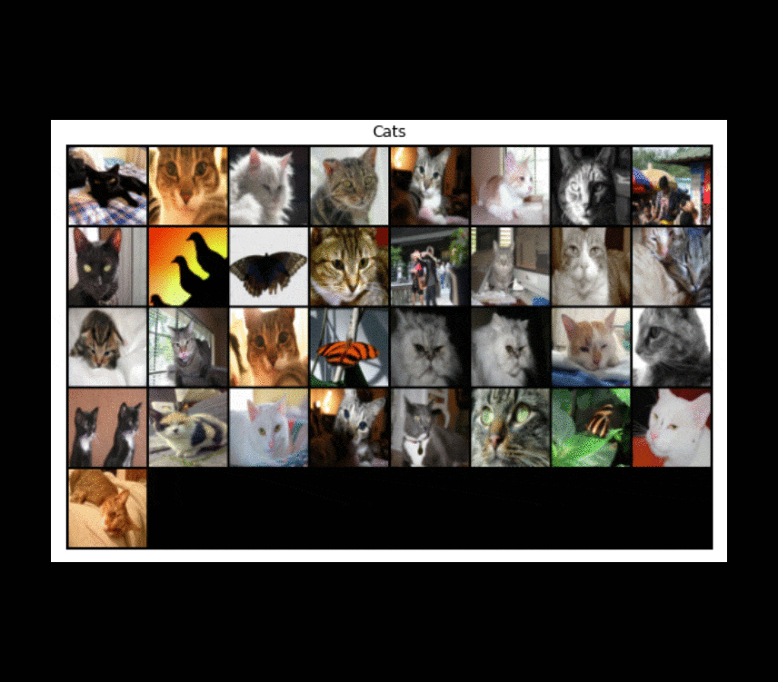

**Learn More**

<a href="https://github.com/rey-allan/deep-learning-mini-projects" title="Source code">
  <svg xmlns="http://www.w3.org/2000/svg" class="icon icon-tabler icon-tabler-code" width="32" height="32" viewBox="0 0 24 24" stroke-width="1.5" stroke="#00abfb" fill="none" stroke-linecap="round" stroke-linejoin="round">
    <path stroke="none" d="M0 0h24v24H0z" fill="none"/>
    <polyline points="7 8 3 12 7 16" />
    <polyline points="17 8 21 12 17 16" />
    <line x1="14" y1="4" x2="10" y2="20" />
  </svg>
</a>

### CommaAI Speed Challenge

This is my attempt at solving [comma.ai](https://comma.ai/)'s speed prediction challenge: given an input video from the front-facing camera of a car, can you predict the speed of the vehicle? Using a video with Ground Truth speed measurements, I trained a ResNet-18 model (pre-trained on ImageNet) with features generated by converting the frames of the video into Motion History Images. The model achieved an MSE of ~5.22 on a dev set of frames obtained from a random split of the training video.

  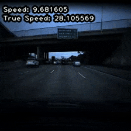

**Learn More**

<a title="https://github.com/rey-allan/commaai-speed-challenge">
  <svg xmlns="http://www.w3.org/2000/svg" class="icon icon-tabler icon-tabler-code" width="32" height="32" viewBox="0 0 24 24" stroke-width="1.5" stroke="#00abfb"" fill="none" stroke-linecap="round" stroke-linejoin="round">
    <path stroke="none" d="M0 0h24v24H0z" fill="none"/>
    <polyline points="7 8 3 12 7 16" />
    <polyline points="17 8 21 12 17 16" />
    <line x1="14" y1="4" x2="10" y2="20" />
  </svg>
</a>

<a title="Training video" href="https://drive.google.com/file/d/1rFCEzdO_OH_xdq8la1p4WZpbU-bF-uKv/view?usp=sharing">
  <svg xmlns="http://www.w3.org/2000/svg" class="icon icon-tabler icon-tabler-brand-youtube" width="32" height="32" viewBox="0 0 24 24" stroke-width="1.5" stroke="#ff2825" fill="none" stroke-linecap="round" stroke-linejoin="round">
    <path stroke="none" d="M0 0h24v24H0z" fill="none"/>
    <rect x="3" y="5" width="18" height="14" rx="4" />
    <path d="M10 9l5 3l-5 3z" />
  </svg>
</a>

### Smash GAN

In this project, I implemented Deep Convolutional Generative Adversarial Networks (DCGAN) to generate new characters from the [Super Smash Bros. Ultimate](https://www.smashbros.com/en_US/) Nintendo game. Although the results are not particularly impressive, the model was able to learn some of the fundamental elements that form the characters: legs, arms and weapon-like silhouettes, and fighting poses.

  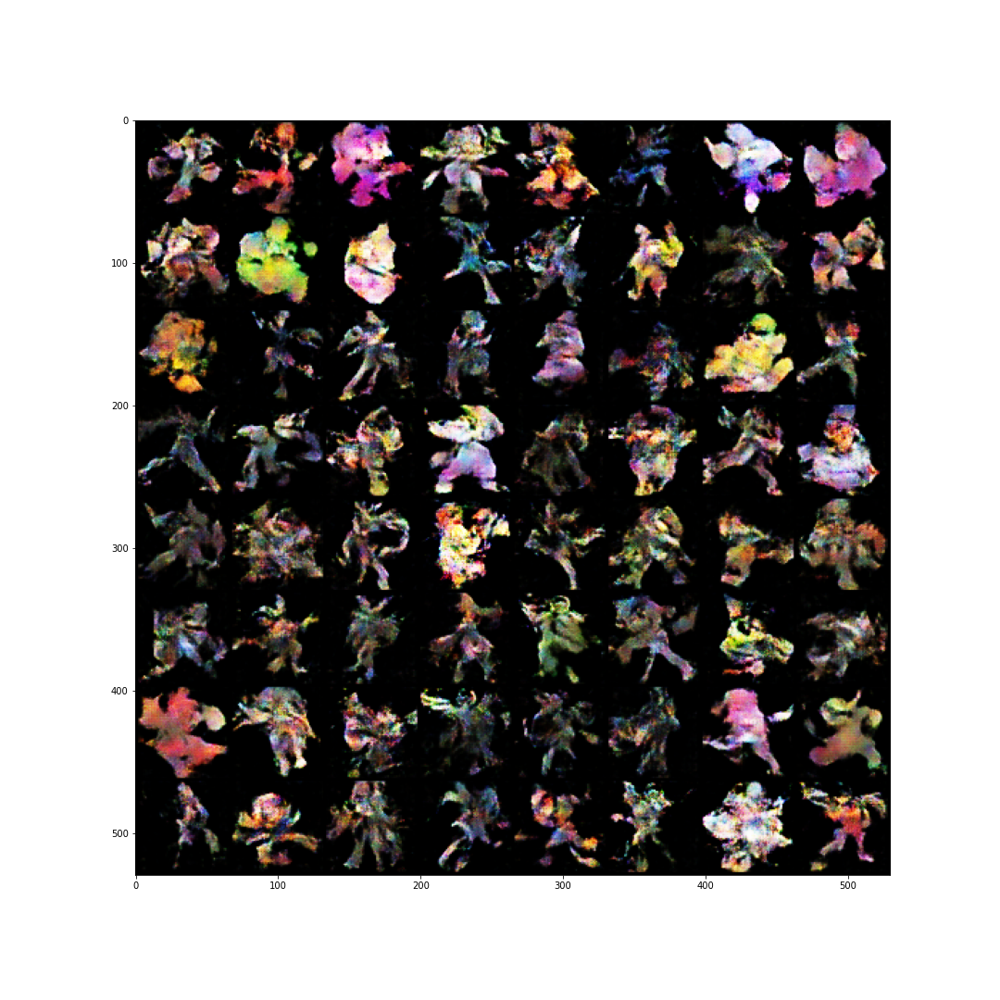

**Learn More**

<a href="https://github.com/rey-allan/smash-gan" title="Source code">
  <svg xmlns="http://www.w3.org/2000/svg" class="icon icon-tabler icon-tabler-code" width="32" height="32" viewBox="0 0 24 24" stroke-width="1.5" stroke="#00abfb" fill="none" stroke-linecap="round" stroke-linejoin="round">
    <path stroke="none" d="M0 0h24v24H0z" fill="none"/>
    <polyline points="7 8 3 12 7 16" />
    <polyline points="17 8 21 12 17 16" />
    <line x1="14" y1="4" x2="10" y2="20" />
  </svg>
</a>

### Solving the Lunar Lander Problem using Deep Reinforcement Learning

In this project, I solved OpenAI's [Lunar Lander](https://gym.openai.com/envs/LunarLander-v2/) gym environment using Deep Reinforcement Learning. I implemented a Deep Q-Network with Experience Replay. The agent was able to maneuver and land the space ship without crashing.

  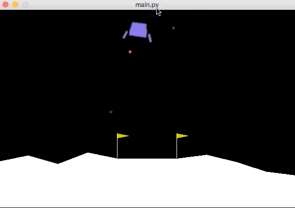

**Learn More**

<a title="Source code available on request only">
  <svg xmlns="http://www.w3.org/2000/svg" class="icon icon-tabler icon-tabler-code" width="32" height="32" viewBox="0 0 24 24" stroke-width="1.5" stroke="#9e9e9e" fill="none" stroke-linecap="round" stroke-linejoin="round">
    <path stroke="none" d="M0 0h24v24H0z" fill="none"/>
    <polyline points="7 8 3 12 7 16" />
    <polyline points="17 8 21 12 17 16" />
    <line x1="14" y1="4" x2="10" y2="20" />
  </svg>
</a>

<a title="Paper" href="https://drive.google.com/file/d/17b1jgs4LEGsztsRN8qJDjRJNhRFh-2wG/view?usp=sharing">
  <svg xmlns="http://www.w3.org/2000/svg" class="icon icon-tabler icon-tabler-file-text" width="32" height="32" viewBox="0 0 24 24" stroke-width="1.5" stroke="#00b341" fill="none" stroke-linecap="round" stroke-linejoin="round">
    <path stroke="none" d="M0 0h24v24H0z" fill="none"/>
    <path d="M14 3v4a1 1 0 0 0 1 1h4" />
    <path d="M17 21h-10a2 2 0 0 1 -2 -2v-14a2 2 0 0 1 2 -2h7l5 5v11a2 2 0 0 1 -2 2z" />
    <line x1="9" y1="9" x2="10" y2="9" />
    <line x1="9" y1="13" x2="15" y2="13" />
    <line x1="9" y1="17" x2="15" y2="17" />
  </svg>
</a>

<a title="Video presentation" href="https://youtu.be/fX3W_SKnuMM">
  <svg xmlns="http://www.w3.org/2000/svg" class="icon icon-tabler icon-tabler-brand-youtube" width="32" height="32" viewBox="0 0 24 24" stroke-width="1.5" stroke="#ff2825" fill="none" stroke-linecap="round" stroke-linejoin="round">
    <path stroke="none" d="M0 0h24v24H0z" fill="none"/>
    <rect x="3" y="5" width="18" height="14" rx="4" />
    <path d="M10 9l5 3l-5 3z" />
  </svg>
</a>

### Correlated Q-Learning

In this project, I implemented three Multi-Agent Reinforcement Learning algorithms, Friend-Q, Foe-Q and Correlated-Q; as well as, the standard Q-Learning algorithm. These algorithms were evaluated against a "soccer" environment modeled as a Markov game. The final results reproduce the original ones obtained by Amy Greenwald and Keith Hall in their paper _Correlated Q-learning_ (2003).

  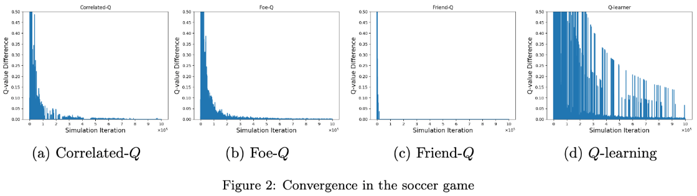

**Learn More**

<a title="Source code available on request only">
  <svg xmlns="http://www.w3.org/2000/svg" class="icon icon-tabler icon-tabler-code" width="32" height="32" viewBox="0 0 24 24" stroke-width="1.5" stroke="#9e9e9e" fill="none" stroke-linecap="round" stroke-linejoin="round">
    <path stroke="none" d="M0 0h24v24H0z" fill="none"/>
    <polyline points="7 8 3 12 7 16" />
    <polyline points="17 8 21 12 17 16" />
    <line x1="14" y1="4" x2="10" y2="20" />
  </svg>
</a>

<a title="Paper" href="https://drive.google.com/file/d/1vqF4m2INpg9K7fTf0lv0ZzXBhDc7UouN/view?usp=sharing">
  <svg xmlns="http://www.w3.org/2000/svg" class="icon icon-tabler icon-tabler-file-text" width="32" height="32" viewBox="0 0 24 24" stroke-width="1.5" stroke="#00b341" fill="none" stroke-linecap="round" stroke-linejoin="round">
    <path stroke="none" d="M0 0h24v24H0z" fill="none"/>
    <path d="M14 3v4a1 1 0 0 0 1 1h4" />
    <path d="M17 21h-10a2 2 0 0 1 -2 -2v-14a2 2 0 0 1 2 -2h7l5 5v11a2 2 0 0 1 -2 2z" />
    <line x1="9" y1="9" x2="10" y2="9" />
    <line x1="9" y1="13" x2="15" y2="13" />
    <line x1="9" y1="17" x2="15" y2="17" />
  </svg>
</a>

<a title="Video presentation" href="https://youtu.be/l-FL23atD0Y">
  <svg xmlns="http://www.w3.org/2000/svg" class="icon icon-tabler icon-tabler-brand-youtube" width="32" height="32" viewBox="0 0 24 24" stroke-width="1.5" stroke="#ff2825" fill="none" stroke-linecap="round" stroke-linejoin="round">
    <path stroke="none" d="M0 0h24v24H0z" fill="none"/>
    <rect x="3" y="5" width="18" height="14" rx="4" />
    <path d="M10 9l5 3l-5 3z" />
  </svg>
</a>

### Temporal Difference Learning: The TD Algorithm

In this project, I reproduced the results presented in Richard S. Sutton's seminal paper _Learning to Predict by the Methods of Temporal Differences_ (1988). I implemented the TD algorithm against a random walk environment to demonstrate how learning can be achieved by updating weights using the gradients of temporal difference errors.

  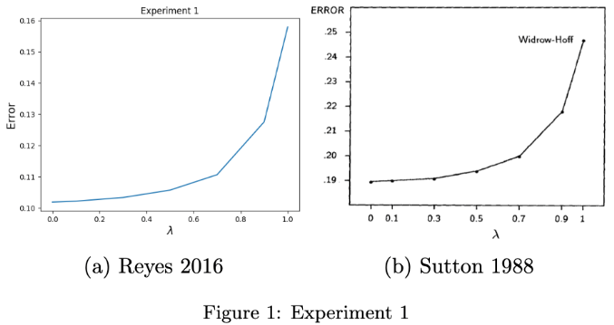
  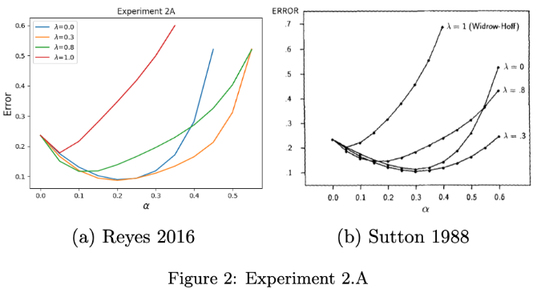
  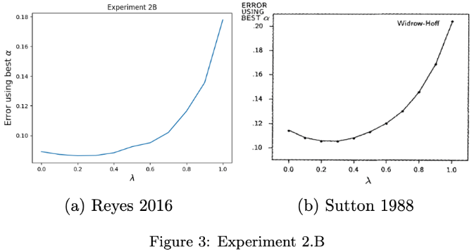

**Learn More**

<a title="Source code available on request only">
  <svg xmlns="http://www.w3.org/2000/svg" class="icon icon-tabler icon-tabler-code" width="32" height="32" viewBox="0 0 24 24" stroke-width="1.5" stroke="#9e9e9e" fill="none" stroke-linecap="round" stroke-linejoin="round">
    <path stroke="none" d="M0 0h24v24H0z" fill="none"/>
    <polyline points="7 8 3 12 7 16" />
    <polyline points="17 8 21 12 17 16" />
    <line x1="14" y1="4" x2="10" y2="20" />
  </svg>
</a>

<a title="Paper" href="https://drive.google.com/file/d/1HzSnN9EW0Vs5nyRo3cJ-OVWGmQ8nG--3/view?usp=sharing">
  <svg xmlns="http://www.w3.org/2000/svg" class="icon icon-tabler icon-tabler-file-text" width="32" height="32" viewBox="0 0 24 24" stroke-width="1.5" stroke="#00b341" fill="none" stroke-linecap="round" stroke-linejoin="round">
    <path stroke="none" d="M0 0h24v24H0z" fill="none"/>
    <path d="M14 3v4a1 1 0 0 0 1 1h4" />
    <path d="M17 21h-10a2 2 0 0 1 -2 -2v-14a2 2 0 0 1 2 -2h7l5 5v11a2 2 0 0 1 -2 2z" />
    <line x1="9" y1="9" x2="10" y2="9" />
    <line x1="9" y1="13" x2="15" y2="13" />
    <line x1="9" y1="17" x2="15" y2="17" />
  </svg>
</a>

<a title="Video presentation" href="https://youtu.be/v5W11EkdYYk">
  <svg xmlns="http://www.w3.org/2000/svg" class="icon icon-tabler icon-tabler-brand-youtube" width="32" height="32" viewBox="0 0 24 24" stroke-width="1.5" stroke="#ff2825" fill="none" stroke-linecap="round" stroke-linejoin="round">
    <path stroke="none" d="M0 0h24v24H0z" fill="none"/>
    <rect x="3" y="5" width="18" height="14" rx="4" />
    <path d="M10 9l5 3l-5 3z" />
  </svg>
</a>

### Trading using Reinforcement Learning

In this project, I applied Q-Learning to the problem of trading equities in the stock market. Technical indicators were used for the _states_ with daily return as the _reward_. The agent was allowed to take three _actions_: long, short or cash (i.e. close a position). The Q-Learning agent was able to find an optimal policy that beat both the benchmark and a rule-based hand-crafted strategy.

  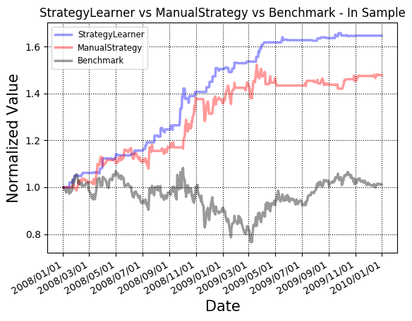

**Learn More**

<a title="Source code available on request only">
  <svg xmlns="http://www.w3.org/2000/svg" class="icon icon-tabler icon-tabler-code" width="32" height="32" viewBox="0 0 24 24" stroke-width="1.5" stroke="#9e9e9e" fill="none" stroke-linecap="round" stroke-linejoin="round">
    <path stroke="none" d="M0 0h24v24H0z" fill="none"/>
    <polyline points="7 8 3 12 7 16" />
    <polyline points="17 8 21 12 17 16" />
    <line x1="14" y1="4" x2="10" y2="20" />
  </svg>
</a>

### Activity Classification using Motion History Images

In this project, I implemented an activity classifier using Random Forests to detect between six different human actvities. The input vector was composed of features derived from different Motion History-based techniques. Using the well-known KTH activity dataset, my model was able to achieve a performance of 86.73% on the test set. Using a video of myself performing the activities, my model was also able to classify multiple activities sequentially with satisfying performance.

  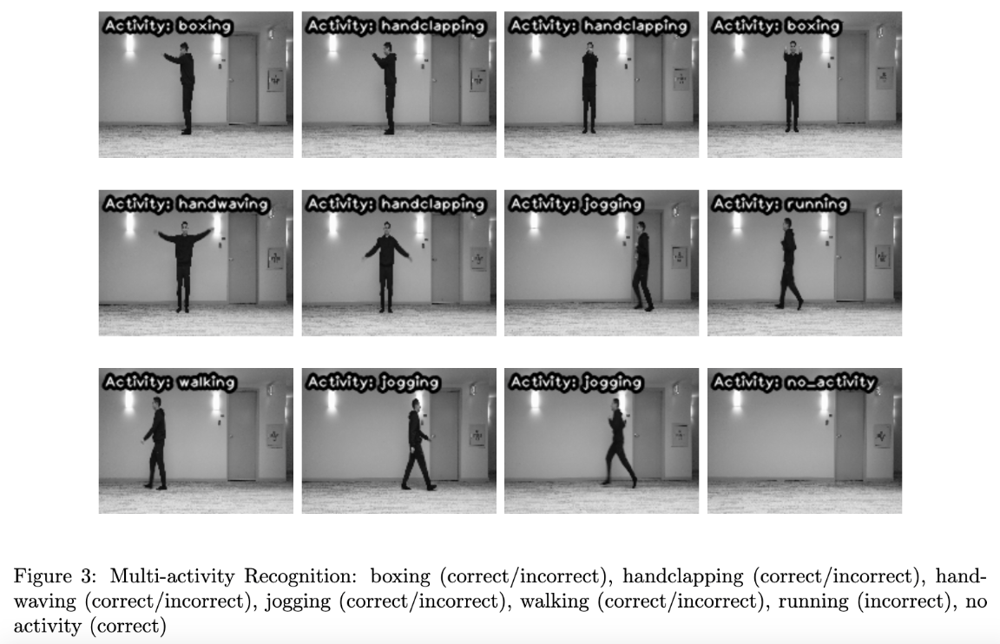

**Learn More**

<a title="Source code available on request only">
  <svg xmlns="http://www.w3.org/2000/svg" class="icon icon-tabler icon-tabler-code" width="32" height="32" viewBox="0 0 24 24" stroke-width="1.5" stroke="#9e9e9e" fill="none" stroke-linecap="round" stroke-linejoin="round">
    <path stroke="none" d="M0 0h24v24H0z" fill="none"/>
    <polyline points="7 8 3 12 7 16" />
    <polyline points="17 8 21 12 17 16" />
    <line x1="14" y1="4" x2="10" y2="20" />
  </svg>
</a>

<a title="Paper" href="https://drive.google.com/file/d/1LCSmjYWJbmnlwVG5vxGcU2rgveq0ftZ0/view?usp=sharing">
  <svg xmlns="http://www.w3.org/2000/svg" class="icon icon-tabler icon-tabler-file-text" width="32" height="32" viewBox="0 0 24 24" stroke-width="1.5" stroke="#00b341" fill="none" stroke-linecap="round" stroke-linejoin="round">
    <path stroke="none" d="M0 0h24v24H0z" fill="none"/>
    <path d="M14 3v4a1 1 0 0 0 1 1h4" />
    <path d="M17 21h-10a2 2 0 0 1 -2 -2v-14a2 2 0 0 1 2 -2h7l5 5v11a2 2 0 0 1 -2 2z" />
    <line x1="9" y1="9" x2="10" y2="9" />
    <line x1="9" y1="13" x2="15" y2="13" />
    <line x1="9" y1="17" x2="15" y2="17" />
  </svg>
</a>

<a title="Video presentation" href="https://youtu.be/9SnzixKRMxM">
  <svg xmlns="http://www.w3.org/2000/svg" class="icon icon-tabler icon-tabler-brand-youtube" width="32" height="32" viewBox="0 0 24 24" stroke-width="1.5" stroke="#ff2825" fill="none" stroke-linecap="round" stroke-linejoin="round">
    <path stroke="none" d="M0 0h24v24H0z" fill="none"/>
    <rect x="3" y="5" width="18" height="14" rx="4" />
    <path d="M10 9l5 3l-5 3z" />
  </svg>
</a>

<a title="Multi-activity recognition demo" href="https://drive.google.com/file/d/1EFPlr3IA4fImDwIlV4Hkck2ddsNhGmvM/view?usp=sharing">
  <svg xmlns="http://www.w3.org/2000/svg" class="icon icon-tabler icon-tabler-brand-youtube" width="32" height="32" viewBox="0 0 24 24" stroke-width="1.5" stroke="#ff2825" fill="none" stroke-linecap="round" stroke-linejoin="round">
    <path stroke="none" d="M0 0h24v24H0z" fill="none"/>
    <rect x="3" y="5" width="18" height="14" rx="4" />
    <path d="M10 9l5 3l-5 3z" />
  </svg>
</a>

### Warehouse Robot

In this project, I developed a robot capable of navigating through a simulated 2D warehouse with the objective of collecting and delivering packages to a specified dropzone. The layout of the warehouse was unknown to the robot. Instead, the robot was provided with an ultrasonic sensor that measured the distance to surfaces (e.g. walls, obstacles and boxes). The "brain" of the robot consisted of two main modules. A localizer and mapper that uses Graph SLAM to reconstruct an estimate layout of the warehouse, and an approximate position of the robot in it. And a planner that uses A Star search to navigate to/from the dropzone once regions were discovered.

  
   
  <strong>Left:</strong> Estimated map and position. <strong>Right:</strong> Actual map and position.

**Learn More**

<a title="Source code available on request only">
  <svg xmlns="http://www.w3.org/2000/svg" class="icon icon-tabler icon-tabler-code" width="32" height="32" viewBox="0 0 24 24" stroke-width="1.5" stroke="#9e9e9e" fill="none" stroke-linecap="round" stroke-linejoin="round">
    <path stroke="none" d="M0 0h24v24H0z" fill="none"/>
    <polyline points="7 8 3 12 7 16" />
    <polyline points="17 8 21 12 17 16" />
    <line x1="14" y1="4" x2="10" y2="20" />
  </svg>
</a>

### Solving Ravens Progressive Matrices

In this project, I implemented an agent to solve Raven's Progressive Matrices tests. RPM's are intended to test human intelligence, in particular, logical associations. My agent works in two phases, each leveraging the knowledge-based technique known as Generate & Test. It first attempts to solve the problem visually via affine transformations of the images. Then, it attempts to solve the problem semantically by building Semantic Networks. My agent obtained a final accuracy of ~69% (133 correct answers out of 192 problems).

  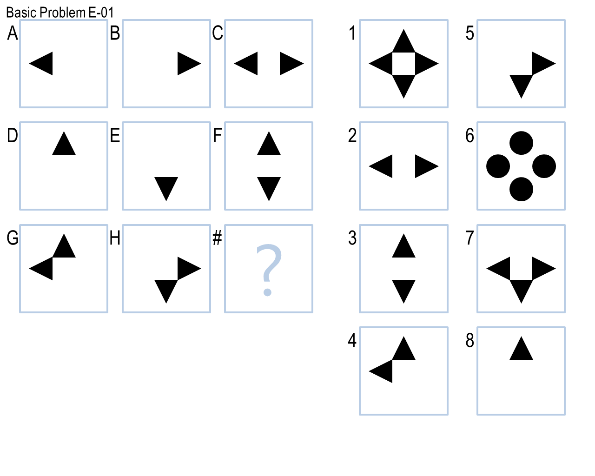
   
  Sample problem with a correct answer 1)

**Learn More**

<a title="Source code available on request only">
  <svg xmlns="http://www.w3.org/2000/svg" class="icon icon-tabler icon-tabler-code" width="32" height="32" viewBox="0 0 24 24" stroke-width="1.5" stroke="#9e9e9e" fill="none" stroke-linecap="round" stroke-linejoin="round">
    <path stroke="none" d="M0 0h24v24H0z" fill="none"/>
    <polyline points="7 8 3 12 7 16" />
    <polyline points="17 8 21 12 17 16" />
    <line x1="14" y1="4" x2="10" y2="20" />
  </svg>
</a>

<a title="Paper I" href="https://drive.google.com/file/d/1-il6RI6ULnCQnQxe8j6ng-7hEqOUwylW/view?usp=sharing">
  <svg xmlns="http://www.w3.org/2000/svg" class="icon icon-tabler icon-tabler-file-text" width="32" height="32" viewBox="0 0 24 24" stroke-width="1.5" stroke="#00b341" fill="none" stroke-linecap="round" stroke-linejoin="round">
    <path stroke="none" d="M0 0h24v24H0z" fill="none"/>
    <path d="M14 3v4a1 1 0 0 0 1 1h4" />
    <path d="M17 21h-10a2 2 0 0 1 -2 -2v-14a2 2 0 0 1 2 -2h7l5 5v11a2 2 0 0 1 -2 2z" />
    <line x1="9" y1="9" x2="10" y2="9" />
    <line x1="9" y1="13" x2="15" y2="13" />
    <line x1="9" y1="17" x2="15" y2="17" />
  </svg>
</a>

<a title="Paper II" href="https://drive.google.com/file/d/1C_EOI6snuywt0p148vu580ELDlXSDiir/view?usp=sharing">
  <svg xmlns="http://www.w3.org/2000/svg" class="icon icon-tabler icon-tabler-file-text" width="32" height="32" viewBox="0 0 24 24" stroke-width="1.5" stroke="#00b341" fill="none" stroke-linecap="round" stroke-linejoin="round">
    <path stroke="none" d="M0 0h24v24H0z" fill="none"/>
    <path d="M14 3v4a1 1 0 0 0 1 1h4" />
    <path d="M17 21h-10a2 2 0 0 1 -2 -2v-14a2 2 0 0 1 2 -2h7l5 5v11a2 2 0 0 1 -2 2z" />
    <line x1="9" y1="9" x2="10" y2="9" />
    <line x1="9" y1="13" x2="15" y2="13" />
    <line x1="9" y1="17" x2="15" y2="17" />
  </svg>
</a>

<a title="Paper III" href="https://drive.google.com/file/d/1AYkBr5tamdFS1gS4B9UnmYlKaCEIAyjR/view?usp=sharing">
  <svg xmlns="http://www.w3.org/2000/svg" class="icon icon-tabler icon-tabler-file-text" width="32" height="32" viewBox="0 0 24 24" stroke-width="1.5" stroke="#00b341" fill="none" stroke-linecap="round" stroke-linejoin="round">
    <path stroke="none" d="M0 0h24v24H0z" fill="none"/>
    <path d="M14 3v4a1 1 0 0 0 1 1h4" />
    <path d="M17 21h-10a2 2 0 0 1 -2 -2v-14a2 2 0 0 1 2 -2h7l5 5v11a2 2 0 0 1 -2 2z" />
    <line x1="9" y1="9" x2="10" y2="9" />
    <line x1="9" y1="13" x2="15" y2="13" />
    <line x1="9" y1="17" x2="15" y2="17" />
  </svg>
</a>

### Effect of Attribute Noise on Binary Classification Models

In this research project, I investigated the effect on the performance of various Supervised Learning algorithms, in particular binary classifiers, when trained with data containing attribute noise. I studied the behavior of the classifiers with varying levels of noise against two different datasets, and compared their performances using different metrics. I also investigated the impact of the dimension of the feature space with respect to the attribute noise based on the contrasting characteristics of the two datasets. The objective was to understand which classifiers perform best in the presence of noise.

  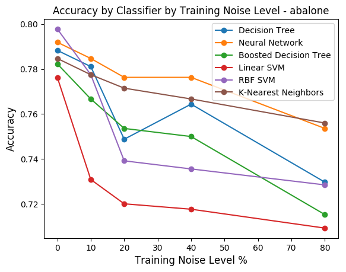
  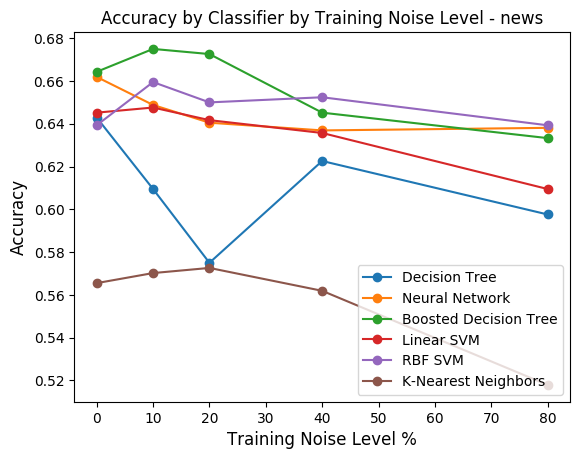

**Learn More**

<a title="Source code available on request only">
  <svg xmlns="http://www.w3.org/2000/svg" class="icon icon-tabler icon-tabler-code" width="32" height="32" viewBox="0 0 24 24" stroke-width="1.5" stroke="#9e9e9e" fill="none" stroke-linecap="round" stroke-linejoin="round">
    <path stroke="none" d="M0 0h24v24H0z" fill="none"/>
    <polyline points="7 8 3 12 7 16" />
    <polyline points="17 8 21 12 17 16" />
    <line x1="14" y1="4" x2="10" y2="20" />
  </svg>
</a>

<a title="Paper" href="https://drive.google.com/file/d/1pj4zJLumNWsVgyn_qQHRLQsdHAUTi3ZX/view?usp=sharing">
  <svg xmlns="http://www.w3.org/2000/svg" class="icon icon-tabler icon-tabler-file-text" width="32" height="32" viewBox="0 0 24 24" stroke-width="1.5" stroke="#00b341" fill="none" stroke-linecap="round" stroke-linejoin="round">
    <path stroke="none" d="M0 0h24v24H0z" fill="none"/>
    <path d="M14 3v4a1 1 0 0 0 1 1h4" />
    <path d="M17 21h-10a2 2 0 0 1 -2 -2v-14a2 2 0 0 1 2 -2h7l5 5v11a2 2 0 0 1 -2 2z" />
    <line x1="9" y1="9" x2="10" y2="9" />
    <line x1="9" y1="13" x2="15" y2="13" />
    <line x1="9" y1="17" x2="15" y2="17" />
  </svg>
</a>

### Benchmarking Randomized Optimization Algorithms

In this research project, I investigated the performance of four different Randomized Optimization algorithms: Randomized Hill Climbing, Simulated Annealing, Genetic Algorithms and MIMIC. I studied their behavior under three different types of optimization problems: Continuous Peaks, Knapsack and Traveling Salesman. I compared their performances using several metrics like fitness, runtime, and others. The objective was to understand which algorithms perform best for each of the problems.

  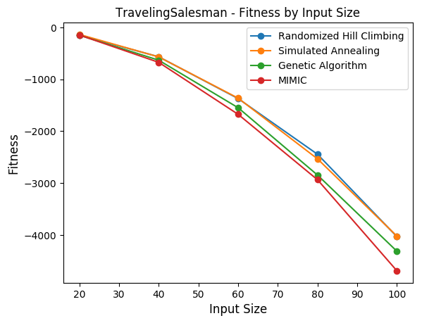
  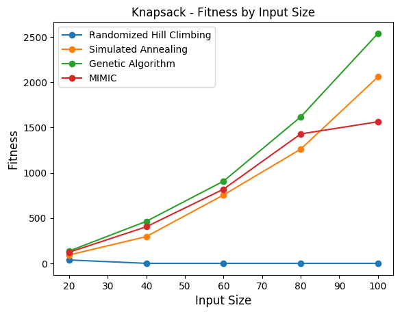
  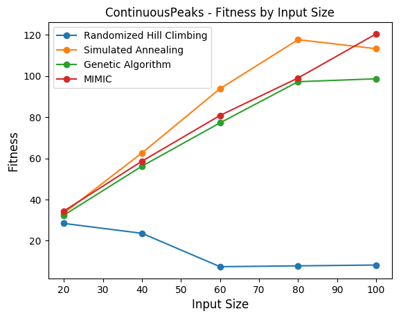

**Learn More**

<a title="Source code available on request only">
  <svg xmlns="http://www.w3.org/2000/svg" class="icon icon-tabler icon-tabler-code" width="32" height="32" viewBox="0 0 24 24" stroke-width="1.5" stroke="#9e9e9e" fill="none" stroke-linecap="round" stroke-linejoin="round">
    <path stroke="none" d="M0 0h24v24H0z" fill="none"/>
    <polyline points="7 8 3 12 7 16" />
    <polyline points="17 8 21 12 17 16" />
    <line x1="14" y1="4" x2="10" y2="20" />
  </svg>
</a>

<a title="Paper" href="https://drive.google.com/file/d/1HABCbab2jdR2WGh8GlNSzPrP19CvtKWQ/view?usp=sharing">
  <svg xmlns="http://www.w3.org/2000/svg" class="icon icon-tabler icon-tabler-file-text" width="32" height="32" viewBox="0 0 24 24" stroke-width="1.5" stroke="#00b341" fill="none" stroke-linecap="round" stroke-linejoin="round">
    <path stroke="none" d="M0 0h24v24H0z" fill="none"/>
    <path d="M14 3v4a1 1 0 0 0 1 1h4" />
    <path d="M17 21h-10a2 2 0 0 1 -2 -2v-14a2 2 0 0 1 2 -2h7l5 5v11a2 2 0 0 1 -2 2z" />
    <line x1="9" y1="9" x2="10" y2="9" />
    <line x1="9" y1="13" x2="15" y2="13" />
    <line x1="9" y1="17" x2="15" y2="17" />
  </svg>
</a>

### A Study On Model-Based And Model-Free Reinforcement Learning

In this research project, I investigated the performance of three of the most common RL algorithms: Value Iteration, Policy Iteration and Q-Learning. I studied their behavior, in terms of rewards obtained and running times, against two environments with different characteristics. A grid world with _frictionless_ floors, and the classic Taxi problem. The objective was to investigate the impact that the dimension of the state, and the complexity of the problem itself have on the performance of the algorithms.

  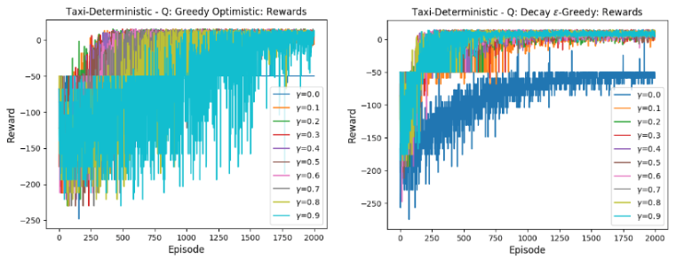

**Learn More**

<a title="Source code available on request only">
  <svg xmlns="http://www.w3.org/2000/svg" class="icon icon-tabler icon-tabler-code" width="32" height="32" viewBox="0 0 24 24" stroke-width="1.5" stroke="#9e9e9e" fill="none" stroke-linecap="round" stroke-linejoin="round">
    <path stroke="none" d="M0 0h24v24H0z" fill="none"/>
    <polyline points="7 8 3 12 7 16" />
    <polyline points="17 8 21 12 17 16" />
    <line x1="14" y1="4" x2="10" y2="20" />
  </svg>
</a>

<a title="Paper" href="https://drive.google.com/file/d/1QwnXFRB4A1IfAhefWq3wwgrDTirL-Bt8/view?usp=sharing">
  <svg xmlns="http://www.w3.org/2000/svg" class="icon icon-tabler icon-tabler-file-text" width="32" height="32" viewBox="0 0 24 24" stroke-width="1.5" stroke="#00b341" fill="none" stroke-linecap="round" stroke-linejoin="round">
    <path stroke="none" d="M0 0h24v24H0z" fill="none"/>
    <path d="M14 3v4a1 1 0 0 0 1 1h4" />
    <path d="M17 21h-10a2 2 0 0 1 -2 -2v-14a2 2 0 0 1 2 -2h7l5 5v11a2 2 0 0 1 -2 2z" />
    <line x1="9" y1="9" x2="10" y2="9" />
    <line x1="9" y1="13" x2="15" y2="13" />
    <line x1="9" y1="17" x2="15" y2="17" />
  </svg>
</a>

### A Study On Clustering and Dimensionality Reduction

In this research project, I studied two of the most common clustering algorithms, K-Means and Expectation-Maximization. I also looked at four different dimensionality reduction techniques: Principal Component Analysis, Independent Component Analysis, Randomized Projections and Factor Analysis. I investigated their features by performing four different experiments using two different datasets. The objective was to understand the behavior of each algorithm under various types of problem spaces, and compare and contrast their advantages and disadvantages.

  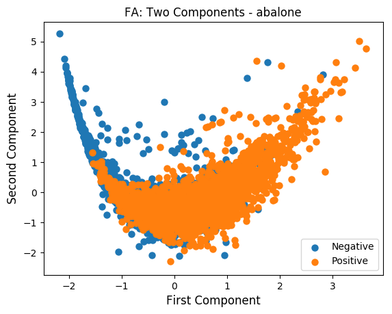
  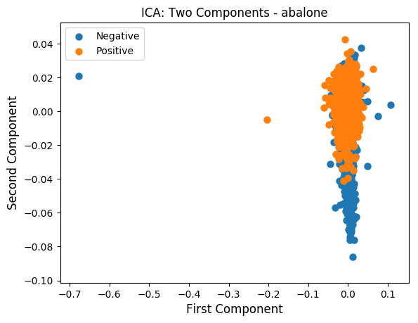
  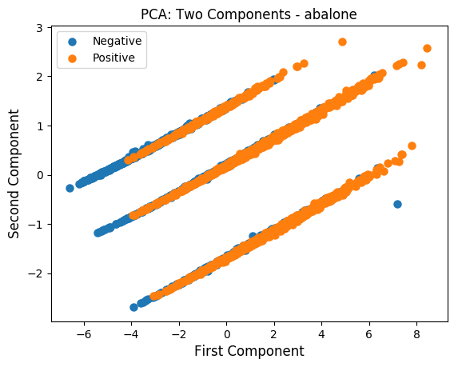
  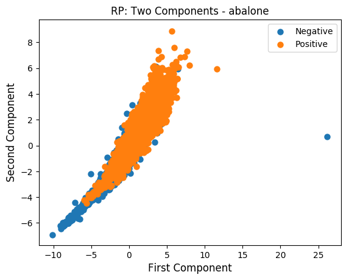

**Learn More**

<a title="Source code available on request only">
  <svg xmlns="http://www.w3.org/2000/svg" class="icon icon-tabler icon-tabler-code" width="32" height="32" viewBox="0 0 24 24" stroke-width="1.5" stroke="#9e9e9e" fill="none" stroke-linecap="round" stroke-linejoin="round">
    <path stroke="none" d="M0 0h24v24H0z" fill="none"/>
    <polyline points="7 8 3 12 7 16" />
    <polyline points="17 8 21 12 17 16" />
    <line x1="14" y1="4" x2="10" y2="20" />
  </svg>
</a>

<a title="Paper" href="https://drive.google.com/file/d/1_4DWMhRh7AVmUa-oVL3aiRXt1wjWN2nD/view?usp=sharing">
  <svg xmlns="http://www.w3.org/2000/svg" class="icon icon-tabler icon-tabler-file-text" width="32" height="32" viewBox="0 0 24 24" stroke-width="1.5" stroke="#00b341" fill="none" stroke-linecap="round" stroke-linejoin="round">
    <path stroke="none" d="M0 0h24v24H0z" fill="none"/>
    <path d="M14 3v4a1 1 0 0 0 1 1h4" />
    <path d="M17 21h-10a2 2 0 0 1 -2 -2v-14a2 2 0 0 1 2 -2h7l5 5v11a2 2 0 0 1 -2 2z" />
    <line x1="9" y1="9" x2="10" y2="9" />
    <line x1="9" y1="13" x2="15" y2="13" />
    <line x1="9" y1="17" x2="15" y2="17" />
  </svg>
</a>

## :toolbox: Languages, Frameworks and Technologies

  
  
  
  
  
  
  
  
  

## :mailbox_with_mail: Want to collaborate? Let's get in touch!

